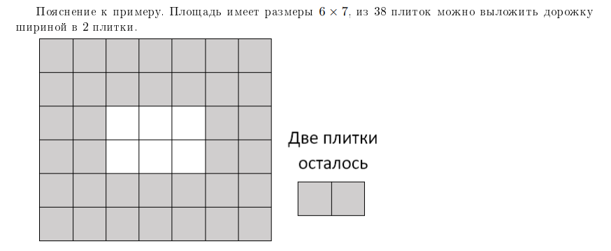

# Задачи для самостоятельного решения 2

Этот проект содержит несколько задач, каждая из которых имеет собственный набор тестов. 
Ниже приведены условия для каждой задачи и инструкции по запуску тестов.


## Условия задач

### Задача 1: [Метро]

**Описание задачи:**  
На некоторых кросс-платформенных станциях метро на разные стороны платформы 
приходят поезда разных направлений. Таня договорилась встретиться с
подругой на такой станции, но поскольку подруга приехала из другого часового пояса, то из-за джет-
лага сильно проспала, и Тане пришлось долго её ждать. Поезда всегда ходят точно по расписанию
и Таня знает, что поезд стоит на платформе ровно одну минуту, а интервал между поездами (время
в течение которого поезда у платформы нет) составляет _**а**_ минут для поездов на первом пути и _**b**_
минут для поездов на втором пути. То есть на первый путь приезжает поезд и стоит одну минуту,
затем в течение _**а**_ минут поезда у платформы нет, затем в течение одной минуты у платформы стоит
следующий поезд и т. д.

Пока Таня стояла на платформе, она насчитала _**n**_ поездов на первом пути и _**m**_ поездов на втором
пути. Определите минимальное и максимальное время, которое Таня могла провести на платформе
или сообщите, что она точно сбилась со счёта

Все поезда, которые видела Таня, она наблюдала в течение всей минуты, то есть Таня не при-
ходит и не уходит с платформы посередине той минуты, когда поезд стоит на платформе

**Формат входных данных:** 

Первая строка входных данных содержит число _**а**_ — интервал между поездами на первом пу-
ти. Вторая сгрока содержит число _**b**_ — интервал между поездами на втором пути. Третья строка
содержит число _**n**_ — количество поездов на первом пути, которые увидела Таня. Четвёртая строка
содержит число _**m**_ — количество поездов на втором пути, которые увидела Таня. Все числа — целые
от 1 до 1000.

**Формат выходных данных:**

Программа должна вывести два числа: минимальное и максимальное время в минутах, которое
Таня могла стоять на платформе, или одно число —1, если Таня точно ошиблась.

**Пример входных данных:** 

| Ввод                | Вывод |
|---------------------|-------|
| 1<br/>3<br/>3<br/>2 | 5 7   |
| 1<br/>5<br/>1<br/>2 | -1    |

### Задача 2: [Площадь]

**Описание задачи:**  
Городская площадь имеет размер _**n**_ x _**m**_ и покрыта квадратной плиткой размером 1 х 1. При
плановой замене плитки выяснилось, что новой плитки недостаточно для покрытия всей площади,
поэтому было решено покрыть плиткой только дорожку по краю площади, а в центре площади раз-
бить прямоугольную клумбу (см. рисунок к примеру}. При этом дорожка должна иметь одинаковую
ширину по всем сторонам площади. Определите максимальную ширину дорожки, когорую можно
выложить из имеющихся плиток.


**Формат входных данных:** 

Первая и вторая строки входных данных содержат по одному числу _**n**_ и _**m**_
(2<_**n**_ < 2×10<sup>9</sup>, 2<_**m**_ < 2×10<sup>9</sup>) — размеры площади
Третья строка содержит количество имеющихся плиток _**t**_, 0 < _**t**_ < _**n**_×_**m**_.

**Формат выходных данных:**

Программа должна вывести единственное число — максимальную ширину дорожки, которую
можно выложить из имеющихся плиток.

**Пример входных данных:** 

| Ввод           | Вывод |
|----------------|-------|
| 6<br/>7<br/>38 | 2     |




### Задача 3: [Много пирожных]

**Описание задачи:**  
На кондитерской фабрике есть _**n**_  видов пирожных, пирожных _i_-го вида на фабрике _**a**_ штук.
Было принято решение отвезти пирожные на продажу на ярмарку, но директор фабрики решил:
что кондитерские изделия на ярмарочной витрине должны быть выложены одинаковыми рядами
при этом пирожных каждого вида должно быть одинаковое количество. Необязательно отвозить на
ярмарку все виды пирожных, можно выбрать некоторые виды и взять одинаковое число пирожных
каждого выбранного вида.
Помогите директору отвезти на ярмарку наибольшее число пирожных — найдите, сколько видов
пирожных и сколько пирожных каждого вида нужно отвезти на ярмарку.

**Формат входных данных:** 

Первая сгрока входных данных содержит число _**n**_ — количество видов пирожных на фабрике
1 < _**n**_ < 2×10<sup>5</sup>. Следующие _**n**_ строк содержат по одному числу 
_**a<sub>i</sub>**_ — количество пирожных _i_-го вида
1 < _**a<sub>i</sub>**_< 2×10<sup>5</sup>. Сумма всех значений _**a<sub>i</sub>**_ не превосходит 
2×10<sup>9</sup>.

**Формат выходных данных:**

Программа должна вывесги два целых числа, Первое число равно количеству видов пирожных
когорые необходимо выбрать для ярмарки. Второе число равно количеству пирожных каждого
выбранного вида, которые нужно отвезти на ярмарку.

Если возможных отвегов несколько, выведите любой из них.

**Пример входных данных:** 

| Ввод                 | Вывод |
|----------------------|-------|
| 3<br/>4<br/>10<br/>7 | 2 7   |

### Задача 4: [Космические шахматы]

**Описание задачи:**  
В космические шахматы играют на бесконечной доске, поэтому клетки нумеруют парой чисел
(см, пример и рисунок к нему). Фигуры ходят по обычным правилам. Составьте маршрут шахмат-
ного коня из клетки (0;0) в заданную клетку (_**x**_, _**y**_)

Напомним, что конь за один ход перемещается на одну клетку по одной оси и на две по другой, то
есть, например, из клетки (0;0) он за один ход может попасть в клетки (1;2), (2; 1), (—1;2), (2;—1),
(1;—2), (-2;1), (1;—2) и (-2;-1)

В качестве ответа Вам нужно вывести любой (не обязательно кратчайший) маршрут с началом
в (0;0) и концом в (_**x**_, _**y**_), длина которого не больше 2×10<sup>5</sup> ходов


**Формат входных данных:** 

Программа получает на вход два целых числа _**x**_ и _**y**_, записанных в отдельных строках, — коор-
динаты конечной клетки маршрута коня. Клетка (_**x**_, _**y**_) не совпадает с началом координат. 
|_**x**_| < 10<sup>5</sup>, |_**y**_| < 10<sup>5</sup>.


**Формат выходных данных:**

Программа должна вывести последовательность ходов, один ход в отдельной строке. В _i_-й строке
должно быть выведено два числа _**x**_ и _**y**_ через пробел — координаты клетки, в которой окажется
конь после _i_-го хода. Количество ходов не должно превышать 10<sup>5</sup>. Последний ход должен вести
в заданную клетку.


**Пример входных данных:** 

| Ввод     | Вывод                          |
|----------|--------------------------------|
| -2<br/>2 | -2 1<br/>0 2<br/>-1 0<br/>-2 2 | 


### Задача 5: [Городские центральные диаметры]

**Описание задачи:**  
В одном большом городе готовятся к открытию новой ветки наземного метро. Она пролегает
между двумя городами в пригороде по разные стороны от самого города, но проходя через него
насквозь. Такую модель наземного метро назвали Городские центральные диаметры (ГЦД)

Врамках подготовки к запуску ГЦД было разработано специальное расписание, содержащее _**n**_
рейсов в одном направлении и _**m**_ рейсов в обратном. Для каждого рейса определены _**a<sub>i</sub>**_
— время
отправления с первой конечной станции и _**b<sub>i</sub>**_ — время прибытия на вторую конечную станцию, для
обратных рейсов _**c<sub>j</sub>**_ — время отправления со второй станции и _**d<sub>j</sub>**_ — 
время прибытия на первую
станцию. Времена измеряются в минутах от начала дня. Внутри большого города поезда могут
передвигаться по различным маршрутам, поэтому поезд, отправившийся позже какого-то другого
поезда, может прибыть раньше него.
Проекты такого масштаба ещб не запускались, а значит, будут происходить непредвиденные
события и поезда будут задерживаться, Аналитики компании, обслуживающей ГЦД, посчитали, что
при любых обстоятельствах поезд может опоздать на конечную станцию не более чем на _t_ минут.
Поезд может отправиться выполнять следующий рейс сразу же, как только закончил предыдущий

Компании поручено во что бы то ни стало обеспечить выполнение каждого рейса, Определите,
какое минимальное количество поездов необходимо иметь, чтобы ни один рейс гарантированно не
был отменён даже в случае возможных задержек всех поездов. Поезда обязаны отправляться от
начальных станций строго по расписанию.

В начале и в конце дня поезда могут находиться на любой из станций. Перемещаться между
станциями во время дня, кроме как по данному расписанию, поезда не могут.

**Формат входных данных:** 

Первая строка входных данных содержит максимальное время задержки при выполнении рейса.
_t_ 0 &le; _t_ &le; 10<sup>9</sup>.

Следующая строка содержит число _**n**_ — количество рейсов в расписании в одну сторону,
0 &le; _**n**_ &le; 100. Следующие **2n** строк содержат числа _**a<sub>1</sub>**_, _**b<sub>1</sub>**_,
_**a<sub>n</sub>**_, _**b<sub>n</sub>**_, — время отправления
поездов от первой станции и время их прибытия на вторую станцию, 
0 &le; _**a<sub>i</sub>**_ < _**b<sub>i</sub>**_ &le; 10<sup>9</sup>.

Следующая строка содержит число _**m**_ — количество поездов в расписании в обратную сторо-
ну 0 &le; _**m**_ &le; 100. Следующие **2m** строк содержат время отправления _**c<sub>j</sub>**_ 
и прибытия _**d<sub>j</sub>**_ поездов
в обратном направлении в аналогичном формате,
0 &le; _**c<sub>j</sub>**_ < _**d<sub>j</sub>**_ &le; 10<sup>9</sup>.

Программа получает на вход два целых числа _**x**_ и _**y**_, записанных в отдельных строках, — коор-
динаты конечной клетки маршрута коня. Клетка (_**x**_, _**y**_) не совпадает с началом координат. 
|_**x**_| < 10<sup>5</sup>, |_**y**_| < 10<sup>5</sup>.


**Формат выходных данных:**

Программа должна вывести одно целое число — минимальное количество поездов, необходимое
для выполнения данного расписания.

**Пример входных данных:** 

| Ввод                                                              | Вывод |
|-------------------------------------------------------------------|-------|
| 4<br/>2<br/>3<br/>8<br/>5<br/>10<br/>1<br/>11<br/>15              | 3     |
| 1<br/>2<br/>15<br/>18<br/>7<br/>9<br/>2<br/>11<br/>14<br/>1<br/>3 | 1     |

  

## Запуск тестов

Чтобы запустить тесты для конкретной задачи, выполните следующее:

Перейдите в директорию задачи. Например, для задачи 1:
   ```bash
    cd task1
    python test_runner.py
   ```

